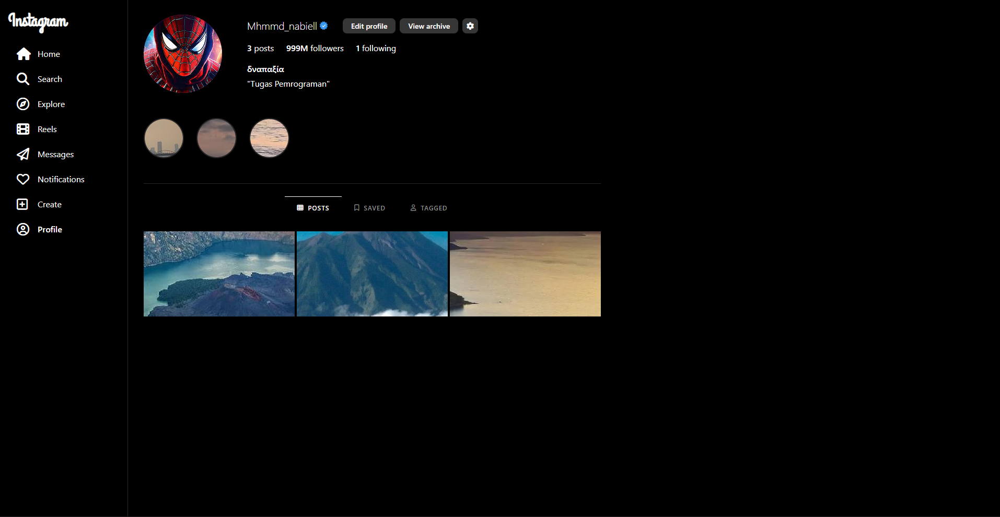

#  Proyek Tampilan Profil Instagram

Proyek ini adalah halaman web statis yang mereplikasi **tampilan profil Instagram**. Dibangun menggunakan **HTML, CSS, Bootstrap 5, Font Awesome**, dan **Google Fonts**. Tujuannya adalah untuk mempelajari bagaimana membuat antarmuka pengguna (UI) yang mirip dengan aplikasi populer menggunakan framework CSS modern.

---

##  Teknologi yang Digunakan

- **HTML5** → Struktur halaman.
- **CSS3** → Styling tambahan untuk meniru desain Instagram.
- **Bootstrap 5.3.8** → Grid system, utilitas responsif, dan tata letak.
- **Font Awesome 6.5.1** → Ikon navigasi sidebar dan tombol.
- **Google Fonts (Grand Hotel)** → Digunakan untuk logo "Instagram".

---

##  Fitur yang Ditampilkan

1. **Sidebar Navigasi**  
   - Menyediakan menu Home, Search, Explore, Reels, Messages, Notifications, Create, dan Profile.  
   - Menggunakan ikon dari **Font Awesome**.  
   - Sidebar tetap menempel di sisi kiri (`position: fixed`).

2. **Header Profil**  
   - Foto profil berbentuk lingkaran dengan *gradient border* khas Instagram Story.  
   - Username, badge centang biru, serta tombol **Edit Profile**, **View Archive**, dan **Settings**.  
   - Statistik profil (Posts, Followers, Following).  
   - Bio singkat dengan nama & kutipan.

3. **Story Highlights**  
   - Ditampilkan dalam lingkaran (seperti di Instagram).  
   - Menggunakan gambar dengan border melingkar.  

4. **Navigasi Postingan**  
   - Tab navigasi: **Posts**, **Saved**, dan **Tagged**.  
   - Tab aktif ditandai dengan border atas berwarna putih.

5. **Grid Postingan**  
   - Galeri postingan dalam format grid (`row` dan `col-4`).  
   - Gambar ditampilkan dalam kotak dengan rasio **16:9**.  

---

##  Penggunaan Bootstrap

- **Grid System** → `row` dan `col-4` untuk menampilkan 3 kolom postingan.  
- **Flexbox Utilities** → `d-flex`, `align-items-center`, `gap-3`, dll.  
- **Buttons** → `btn btn-profile` (dikustomisasi dengan CSS).  
- **Spacing Utilities** → `mb-3`, `px-3`, `py-1`, `gap-4`, dsb.  
- **Typography Utilities** → `fw-bold`, `fw-light`, `fs-6`, dll.  

---

##  Cara Menjalankan Proyek

1. Clone repositori ini atau salin kode HTML.
2. Pastikan komputer memiliki koneksi internet untuk memuat **Bootstrap CDN**, **Font Awesome**, dan **Google Fonts**.
3. Buka file `index.html` menggunakan browser modern (Chrome, Edge, Firefox).
4. Halaman profil Instagram tiruan akan langsung tampil.

---

##  Catatan

- Semua gambar diambil dari internet (unsplash/pinterest/website terkait).  
- Proyek ini hanya untuk tujuan **pembelajaran** dan **demonstrasi UI**, bukan aplikasi resmi Instagram.  
- Kamu bisa menambahkan lebih banyak fitur interaktif dengan **JavaScript**.

---

##  Preview

---

## ✨ Kesimpulan

Dengan memanfaatkan **Bootstrap** dan **CSS custom**, proyek ini berhasil meniru tata letak profil Instagram dengan kode yang relatif sederhana, responsif, dan mudah dikembangkan.  

