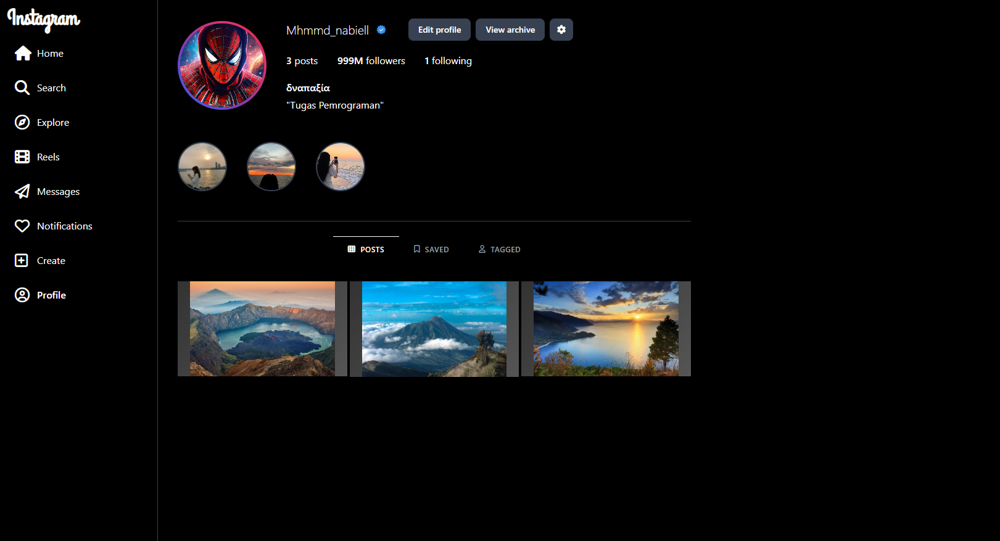

#  Proyek Tampilan Profil Instagram (Tailwind CSS)

Proyek ini adalah halaman web statis yang mereplikasi **tampilan profil Instagram** menggunakan **HTML**, **Tailwind CSS**, **Google Fonts**, dan **Font Awesome**.  
Tujuan utamanya adalah untuk latihan membangun antarmuka pengguna (*UI*) modern yang mirip aplikasi populer.

---

##  Teknologi yang Digunakan

- **[Tailwind CSS](https://tailwindcss.com/)** → Framework utility-first CSS untuk styling yang cepat dan konsisten.
- **[Google Fonts](https://fonts.google.com/)** → Digunakan font *Grand Hotel* pada logo "Instagram".
- **[Font Awesome](https://fontawesome.com/)** → Untuk ikon navigasi (Home, Search, Explore, Reels, dll).
- **HTML5** → Struktur dasar halaman.

---

##  Fitur Utama

1. **Sidebar Navigasi**
   - Menu navigasi tetap di sisi kiri (sticky sidebar).
   - Menggunakan ikon dari Font Awesome.
   - Warna latar hitam seperti tema Instagram.

2. **Header Profil**
   - Foto profil dengan efek **gradient border**.
   - Username + badge centang biru.
   - Tombol aksi: Edit profile, View archive, dan Settings.
   - Statistik jumlah post, followers, dan following.
   - Bio profil sederhana.

3. **Story Highlights**
   - Lingkaran highlight dengan gambar.
   - Efek hover border untuk interaksi.

4. **Bagian Postingan**
   - Navigasi tab: Posts, Saved, Tagged.
   - Grid postingan 3 kolom dengan aspect ratio video.
   - Gambar post ditampilkan full menggunakan `object-cover`.

---

##  Preview

Tambahkan screenshot hasil tampilan di sini:  

---

##  Struktur Proyek
 │── index.html # File utama 
 │── centang.png # Badge centang biru (opsional, ganti sesuai kebutuhan) 

---

##  Cara Menjalankan
1. Download atau clone repository ini  
2. Pastikan terkoneksi internet (karena menggunakan CDN untuk Tailwind & Font Awesome)  
3. Buka file `index.html` di browser  

---

##  Preview Tampilan
Tampilan menyerupai halaman **Instagram Profile Page** dengan sidebar di sebelah kiri dan konten profil di sebelah kanan.  
Jika ingin melihat hasilnya, cukup buka file `index.html` di browser favorit kamu.  

---

##  Customisasi
- Ubah **username, bio, dan gambar profil** di bagian profile header  
- Ganti **highlight images** sesuai kebutuhan  
- Tambahkan atau ubah **post images** di bagian grid posts  
